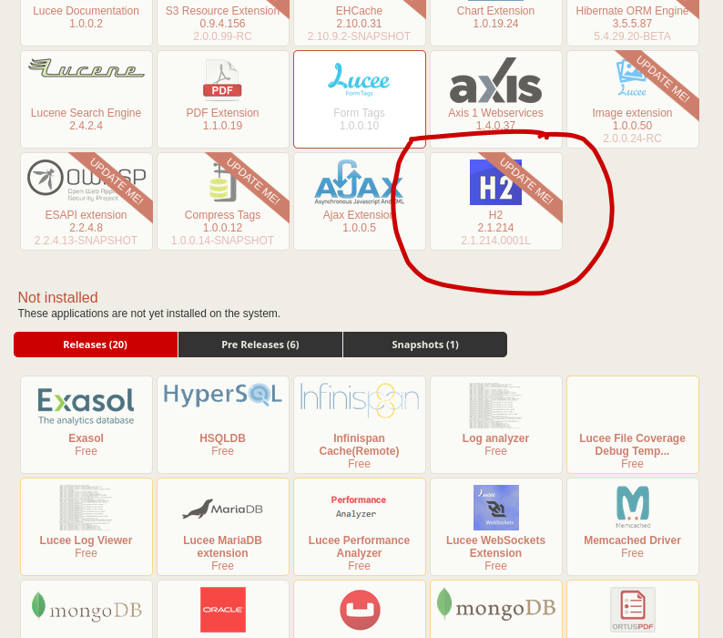
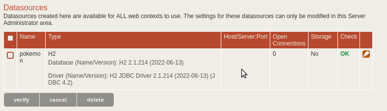
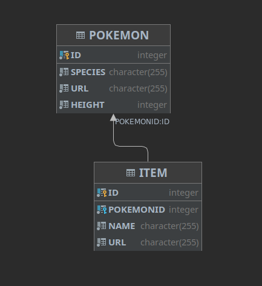
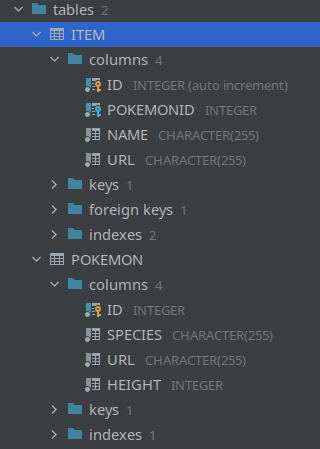

# Pokemon adventure

Welcome! Cupid Media's CFML homework assigned is meant to be an approximation of work at the company when working on new products. The sample application and the task might be a bit contrived, but the concepts are things that you may deal with on a day-to-day basis in our team.

We respect your time and we know that going through hiring processes can be time-consuming and stressful, so we request that you don't spend much more time than a few hours completing the assignment (excluding setup). If you finish faster, great! If you get part of the way through, that's no problem either. 

Please treat the work as if it was a real task though. You will have the opportunity to explain decisions you've made based on these constraints when you create your Pull Request on Github.

## Overview

This mini application is based on the Coldbox 6 REST template.

It interacts with the PokeAPI (https://pokeapi.co) and an embedded H2 database (the file is in the `/database` directory). 

We're going to send you on a backend development Pokemon adventure.

Further down you will find instructions to setup and then to do some work in this codebase.

We do realise that not everyone might know ColdBox, CommandBox, TestBox and others to the fullest extent. However, these platforms have become standard CFML development tools over the last 5-6 years. 

We feel strongly about applying modern CFML development practices to our work and expect this from our candidates as well.

There is plenty of documentation available for all the tools you need to complete your adventure, feel free to use the internet or developer (support) communities for additional research and information beyond what is provided here. Strong research ability is a great software engineering skill to have.

## Installation

To make the installation and setup for you locally as easy as possible, this codebase is setup to run in Commandbox with Lucee almost out of the box (pun intended).

1. Please install CommandBox on your system (if you don't have it yet).

2. Make sure to install CFConfig in CommandBox: https://cfconfig.ortusbooks.com/using-the-cli/installation

3. Fork this repository into your own Github account, clone a local copy to your system and while being in in Commandbox in the root directory of this repository on your system, run:

	```
	install
	```

	This will setup all the needed dependencies for the application. 

4. Then start the server by running:

	```
	server start
	```

	Usually your default browser will open, rendering `http://127.0.0.1:<port>` and show some JSON response as follows:

	```
	{
	"data": "Welcome to my ColdBox RESTFul Service",
	"error": false,
	"pagination": {
		"totalPages": 1,
		"maxRows": 0,
		"offset": 0,
		"page": 1,
		"totalRecords": 0
	},
	"messages": []
	}
	```

	Lucee Admin will be available on `http://127.0.0.1:<port>/lucee/admin/server.cfm` and the pre-set password is `test1234`.

	CommandBox assigns a random port to your server - but you can customise the port and many other settings as described here: https://commandbox.ortusbooks.com/embedded-server/server.json

5. In Lucee Admin, in `Extensions -> Applications` install the H2 extension, version 2.1.214

	

6. In Lucee Admin verify that you have a datasource `pokemon`. 

	

	

	If you don't or if the datasource doesn't verify, it means that your CFConfig installation is not correct.

	CFConfig will try to load `.cfconfig.json` into your Lucee server when it starts. It uses `DB_DATABASE_PATH` from `.env` to point to the physical H2 database file's directory and you will have to configure the path so that it matches your local environment (URL encoded as outlined in `.env`).

	Note: you will have to stop and restart your server after changed to `.env` for them to be picked up.

## The application

After the application is up and running you should inspect the code base.

As we mentioned, this is a ColdBox 6 REST application. The routing is controlled via `/config/Router.cfc` and the REST handlers (the entrypoints into the system) are in `/handlers`

You will be mainly looking at the REST endpoint `/api/pokemon/{pokemonId}`. Use the Router to find out which Handler it uses and see what is happening inside. A good `pokemonId` to initally try is `35`: `/api/pokemon/35`.

You can safely ignore all the other existing endpoints in the application - feel free to use them for inspiration and good coding practices, but you won't have to change any of them.

### Intended functionality

When the API endpoint is called with a valid `pokemonId`, the code should go to the PokeAPI (see above), request information about the Pokemon (namely Name, URL, height and - if avaible - all items it can hold).

This information should then be locally inserted into two related H2 DB tables:





When a pokemon is requested again, existing records for that Pokemon in the local database should be updated appropriately.

### Existing code

The existing code is in a *terrible* state. It was written about 20 years ago and is simply a single `.cfm` template that is being included from the handler. 

It's *mostly* functional (but there seems to be a problem with handling of the repeat calls we mentioned above), but it's written in CFML tags, everything is lumped into one file and the developer(s) didn't stick to any sensible naming conventions.

There's also a few things weird with regards to what the endpoint returns. It seems to be a sentence and always with status code 200. Maybe that should be looked at too and be more API-ified. The validation seems to have some weaknesses as well.

The application already has unit and integration tests in `/test` that can be executed with `http://127.0.0.1:<port>/tests/runner.cfm`

## A few notes

Before you start, we would like to ask you to keep a few things in mind:

- After you're done with your changes, we should be able to run the application and it should not error.
- Do not make any changes to the version of Lucee or any other dependencies .
- Do not refactor or restructure any code that is not directly related to your assigned.
- It's up to you if you want to include additional 3rd-party libraries for certain parts of your refactorings. However, if you do so, they need to become part of the regular CommandBox package management of the application.
- It's up to you how you want to manage flows in commits and branches locally. But - the end result has to be a single Pull Request from your forked repository on Github against our repository on Github.

## Your assignment

You've been given the task to refactor the Pokemon endpoint of the application into modern CFML. The general expectations are:

- The code consists of script-based components. If you want to use Lucee `tag islands` for query-based code inside a script component, that's cool though. No one should ever be forced to write SQL in CFScript :-)
- You follow good practices for a separation between the handler, service/business logic and Data Access Objects (DAO) in the model directory's `com.cupidmedia.pokemon` package. 
- Your endpoint code is ideally written in a flexible and testable way with unit and integration tests.

If you are having trouble starting, here are a few examples of what we will be looking for in the PR:

- Solid abstraction of 3rd party APIs used
- Good validation of input data 
- Usage of object-oriented design and patterns
- Test coverage of the new/refactored code you've written with unit and integration test
- Following not only the happy path but also deal with validation and exceptions and handle them appropriately
- Already known issues (remember the comment about the repeated calls? And the validation issues? Yup, all that...) should be addressed appropriately somehow.
- Display of good GitHub hygeniene - please avoid thing like "temp commit 1" etc - each changeset should have a clear purpose and boundary

### Submitting your assignment

Once you've finished, push your changes to your repository on Github and create a Pull Request against our repository with your changes.

Write a description of your code changes, including any decisions or trade-offs you made. If you end up introducing nerw libraries please point that out, telling us what those are and why you had to add them.

Since a few hours is not a lot of time, include anything you would have done or changed, given more time.

We also welcome any comments or suggestions you may have to improve the assignment. Giving and receiving feedback are very important skills for us.

## Final Thoughts

Have any questions? Please ask!